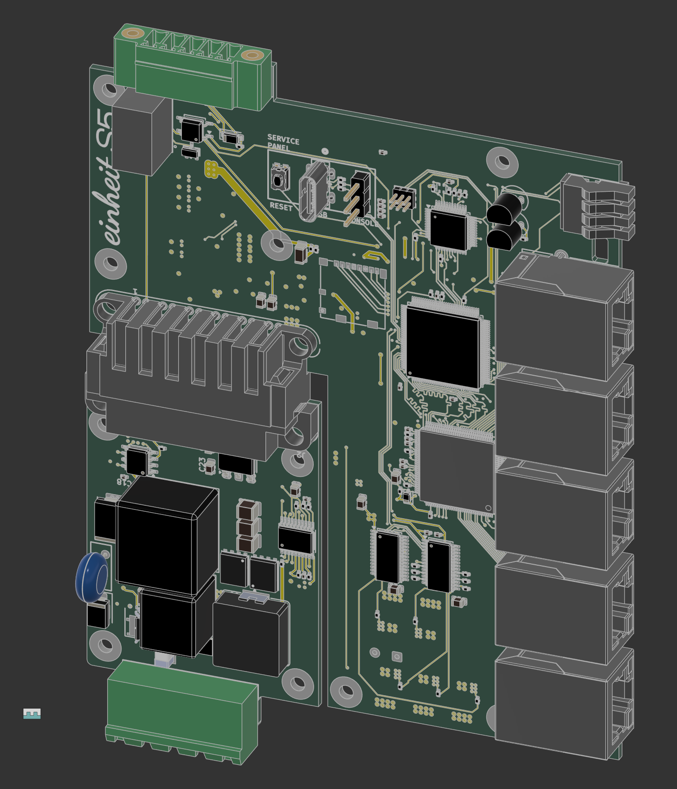
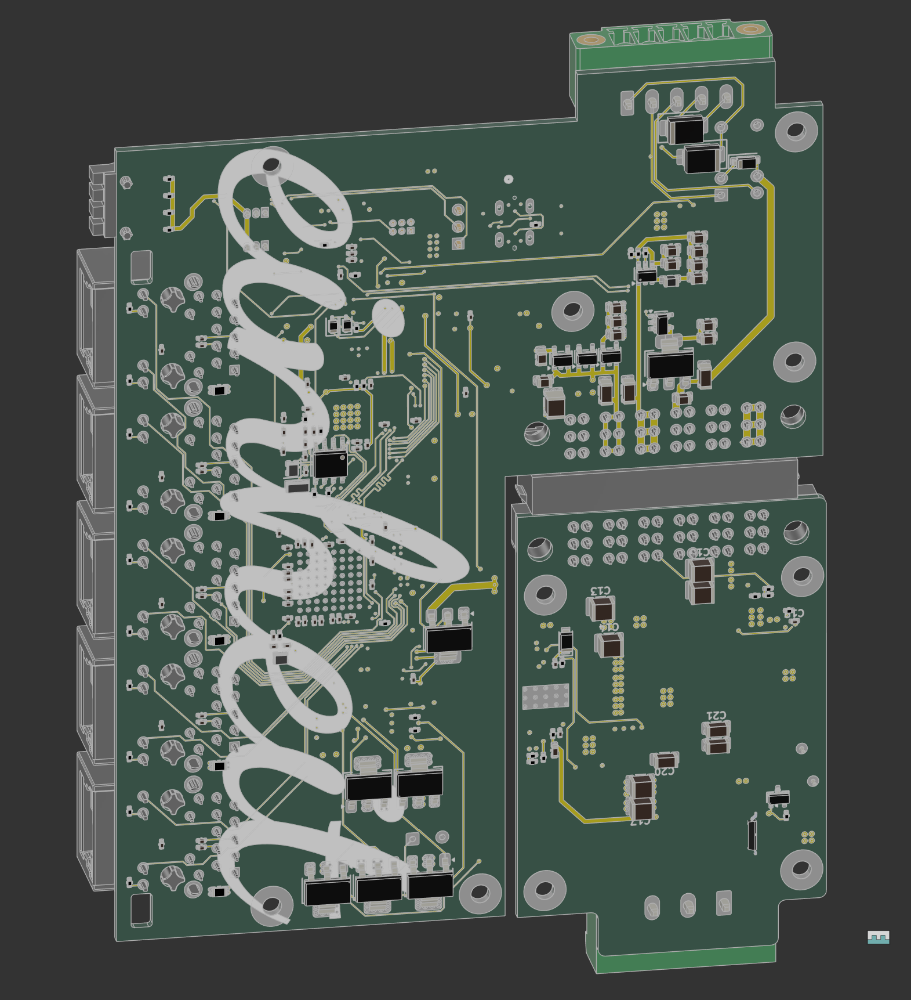
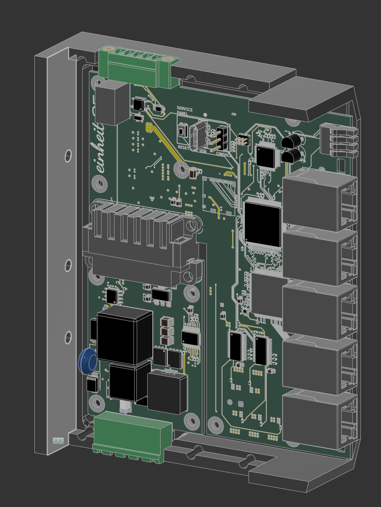
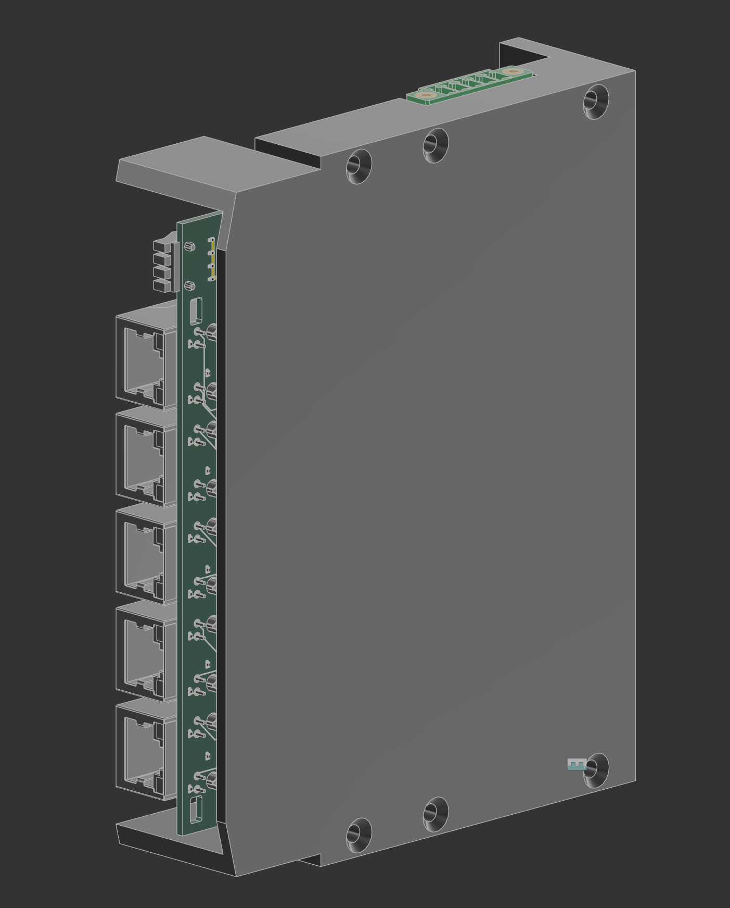
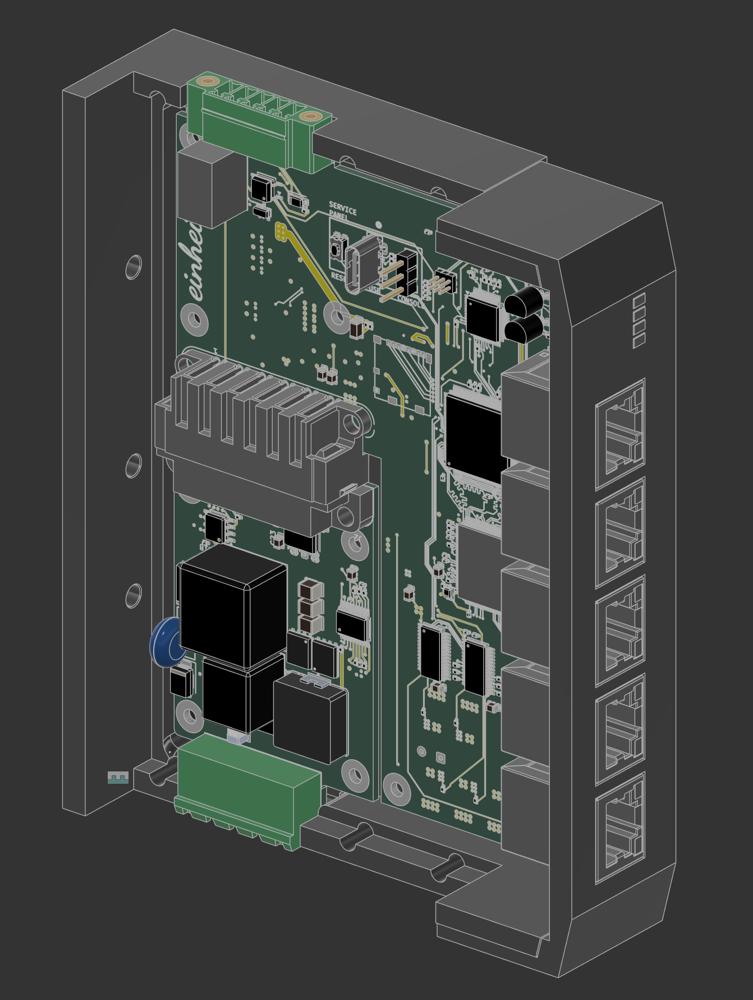
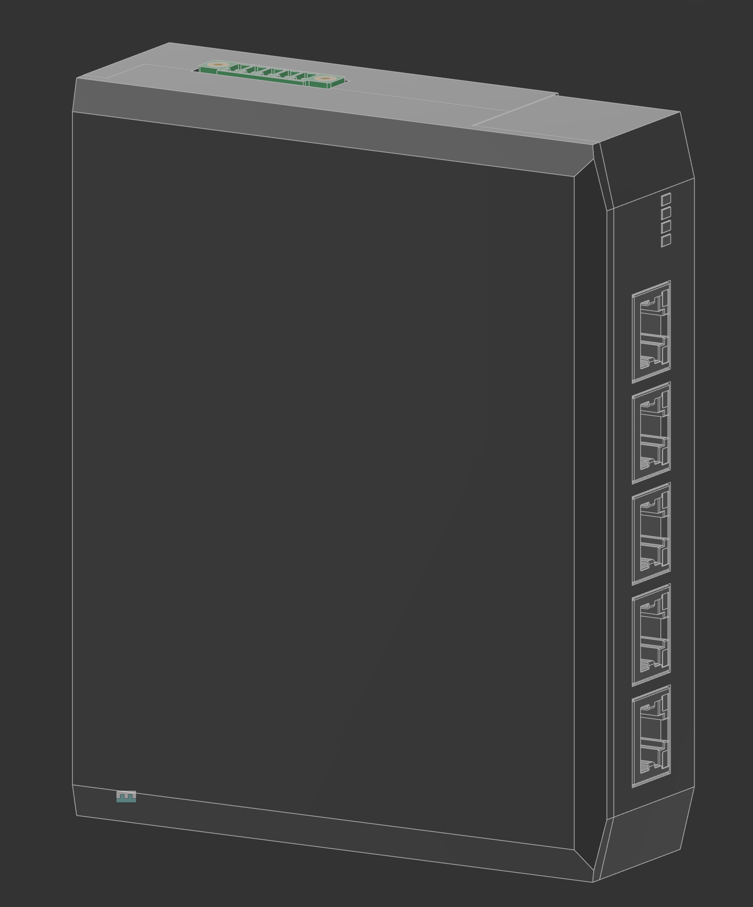
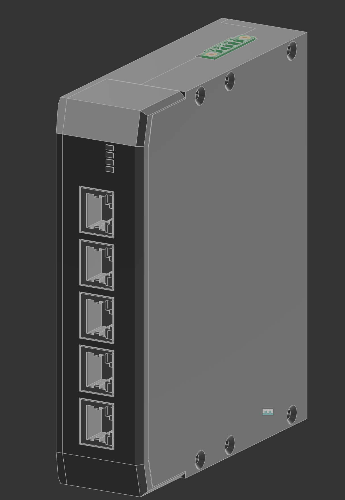
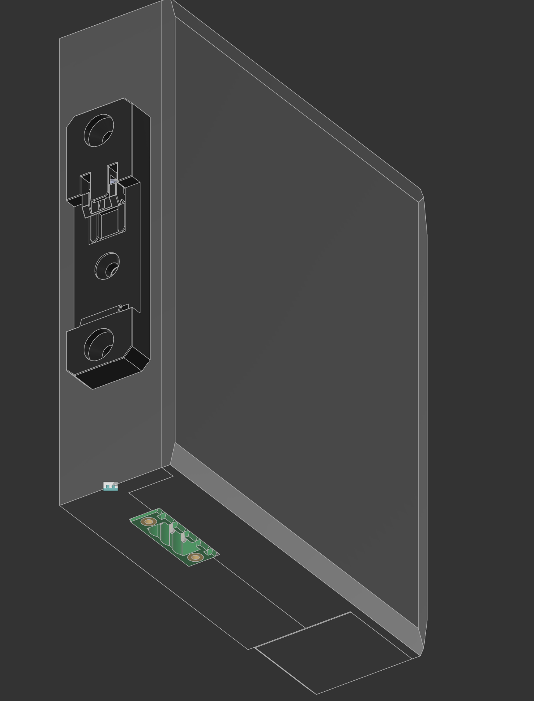
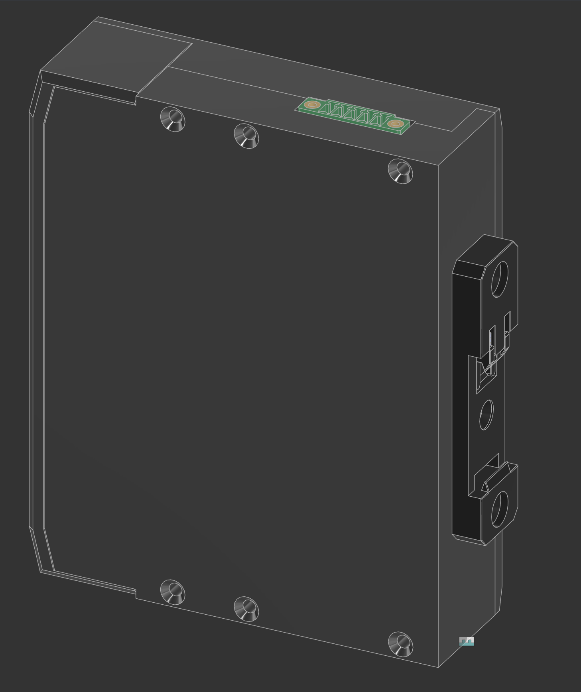

# s5 — 3D renders

3D views of the einheit **s5** core board and its DIN-rail enclosure, captured
2026-07-13 (KiCad 3D viewer + Fusion). Roughly board views first, enclosure last.

## screenshot_1

## screenshot_2

## screenshot_3

## screenshot_4

## screenshot_5

## screenshot_6

## screenshot_7

## screenshot_8

## screenshot_9

